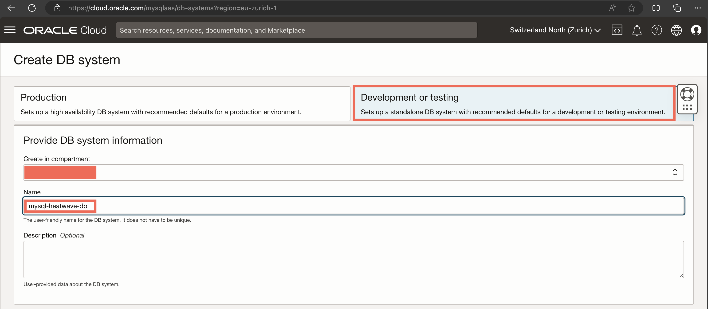
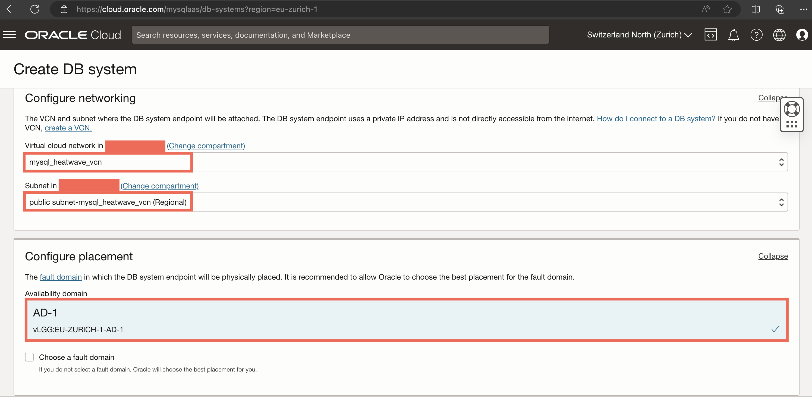
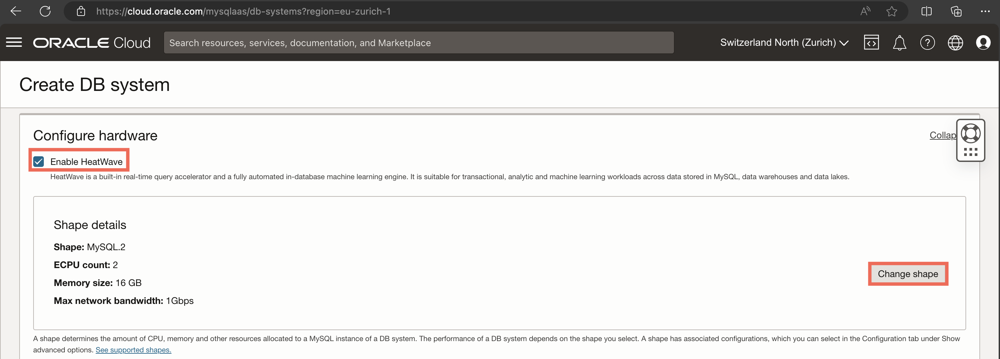
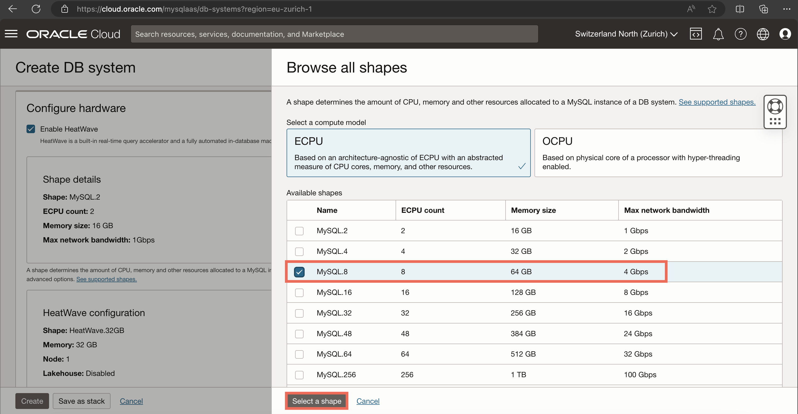
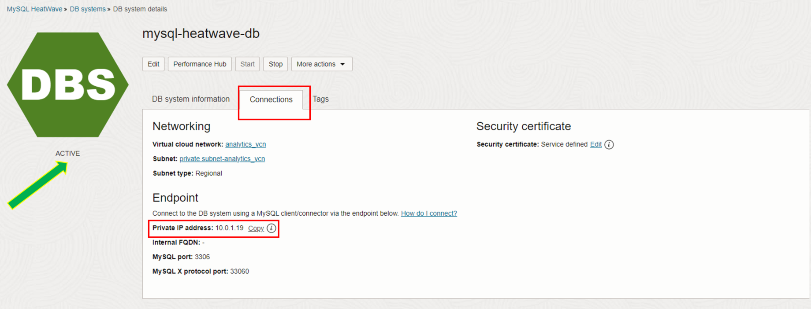

# Setup a MySQL HeatWave Database System

## Overview 
In this crucial segment of our workshop, you will embark on the journey of setting up a MySQL HeatWave database. This process involves creating a database instance within the Oracle Cloud Infrastructure (OCI) and configuring it to utilize the powerful analytics and machine learning capabilities of MySQL HeatWave.

This lab is designed to provide participants with the hands-on experience and knowledge required to successfully deploy and manage a MySQL HeatWave database, setting the stage for exploring the vast analytics and machine learning functionalities that HeatWave offers.

## Objectives
- Understand the architecture and benefits of MySQL HeatWave within the context of Oracle Cloud Infrastructure.
- Learn the step-by-step process for creating a MySQL database instance that is compatible with HeatWave.
- Configure a HeatWave cluster and attach it to the MySQL database system, preparing the environment for high-performance analytics and machine learning tasks.

## Prerequisites
- Active Oracle Cloud Account: Participants must have an Oracle account set up, as detailed in the previous workshop lab.
- Access to OCI Console: Ensure that you can log in to the Oracle Cloud Infrastructure console with appropriate permissions to create and manage database services.
- Basic Knowledge of Cloud Databases: Familiarity with cloud computing concepts and databases will aid in understanding the setup process and HeatWave's capabilities.
- Oracle Cloud Infrastructure Fundamentals: A basic understanding of OCI components such as Virtual Cloud Networks (VCN) covered in the previous lab.

## Step 1: Access the DB Systems Section

- On the OCI Console, go to the hamburger menu, then choose *Databases* and *DB Systems* under the MySQL HeatWave section

## Step 2 : Create your Database System

- From this page, click on *Create DB System*.

- Choose *Development or testing*, then give a name to your DB system.

## Step 3: Setup the admin credentials

- Scroll down to *Create administrator credentials*, create username and password, and make sure that *Standalone* is selected.

## Step 4: Choose the VCN and MySQL version of your DB

- Scroll down to the *Configure networking* section. Make sure to choose the VCN and `public` subnet you created in the previous Lab. You can leave the *Configure placement* section unchanged.

- Scroll down to the end of the page first, and click on *Show advanced options*. Change to the *Configuration* tab and choose *8.3.0 - Innovation* as MySQL version. Do not click on *Create* yet!

## Step 5: Attach and configure a Heatwave cluster 

- Scroll back up to the *Configure hardware* section, and make sure that *Enable HeatWave* is checked. First, we change the configuration of the core MySQL node to MySQL.8, as follows:

- Then, we change the configuration of the HeatWave cluster to have 2 nodes and the HeatWave.512GB shape, as well as enable the Lakehouse functionality.

- Finally, scroll down to the *Configure backup plan* section and make sure to `disable` point-in-time recovery, then click on *Create*.

* Give it a few minutes until all the infrastructure is created for you. Take note of your assigned Private IP Address as you will need it to connect to your Database System. Happy HeatWaving!

## Conclusion

Congratulations on successfully provisioning a MySQL database system and attaching a HeatWave cluster to it! 

This achievement marks a significant milestone in your journey toward leveraging the advanced analytics and machine learning capabilities offered by MySQL HeatWave. With your database system and HeatWave cluster now in place, you have laid the groundwork necessary for high-performance data processing and analysis within the Oracle Cloud Infrastructure.

The forthcoming step involves utilizing the Object Storage service to create a bucket. This bucket will provide you a secure and scalable solution for storing and managing the vast amounts of data that our MySQL HeatWave database and cluster will process and analyze.

[Lab 3: Object Storage](object_storage/README.md)